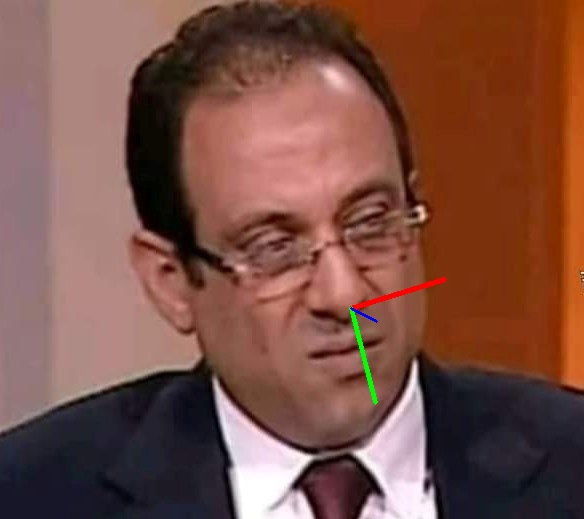
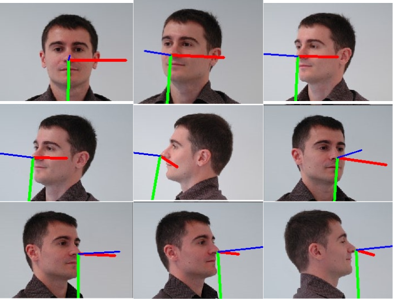

# Head pose estimation

## first we use the data of faces & angles (yaw,pitch,roll) AFLW2000 ,and we use mediapipe to extract 468 point of each face then combine the two into one data frame which  consists of the points and the angles

## second we train three models (randomforest) to estimate the angles , used random search grid to help finding best models

## finally we draw the axis to see the results on images,video and webcam

### Here are some results

   

